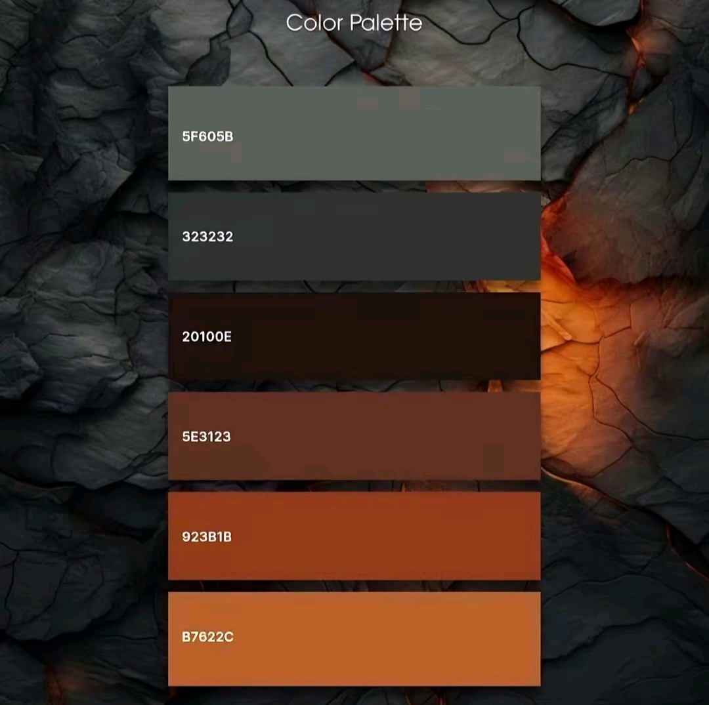
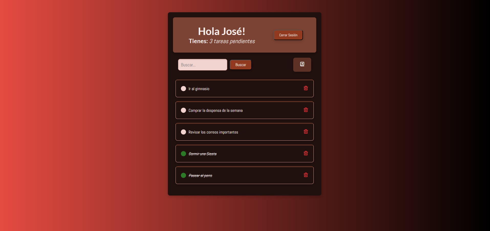
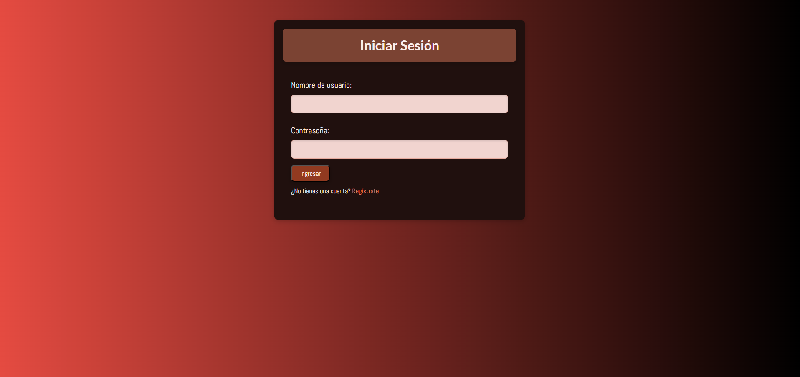
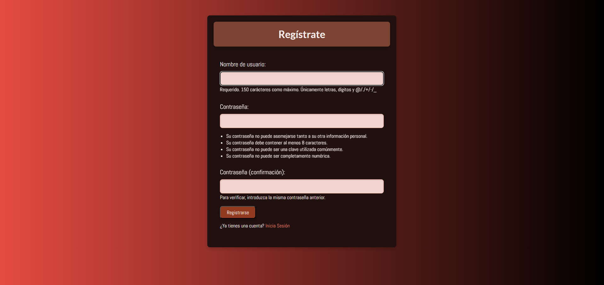
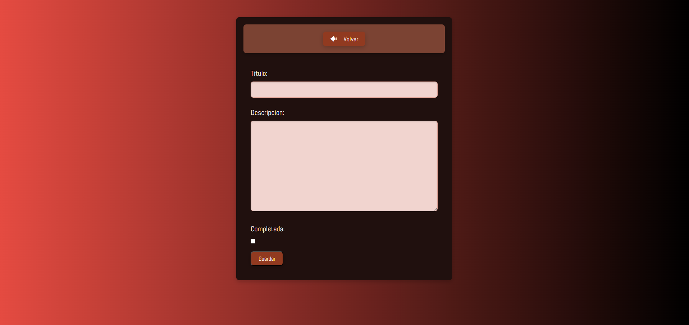
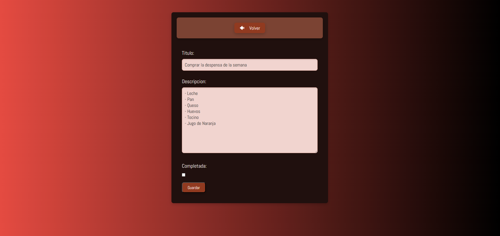
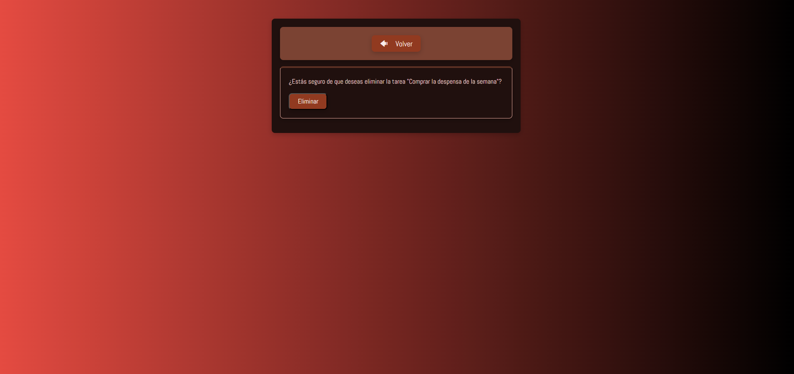
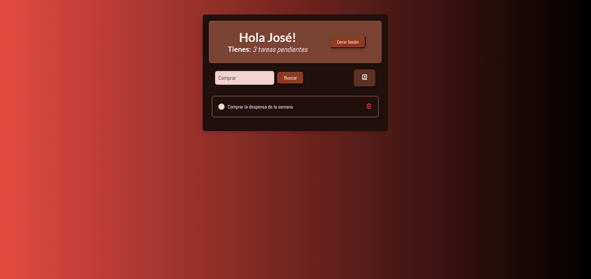

# WebToDo - Aplicación de Tareas Pendientes

Una aplicación web de gestión de tareas pendientes desarrollada con Django, que permite a los usuarios crear, editar, eliminar y buscar sus tareas de manera intuitiva y eficiente.

## 📋 Descripción

WebToDo es una aplicación web completa que proporciona a los usuarios una interfaz moderna y elegante para gestionar sus tareas diarias. Cuenta con un sistema de autenticación robusto y una experiencia de usuario optimizada con un diseño responsive y atractivo.

## ✨ Características

- **Sistema de Autenticación**: Registro e inicio de sesión de usuarios
- **Gestión Completa de Tareas**: Crear, leer, actualizar y eliminar tareas (CRUD)
- **Estado de Tareas**: Marcar tareas como completadas o pendientes
- **Búsqueda Inteligente**: Buscar tareas por título
- **Interfaz Moderna**: Diseño responsive con gradientes y efectos visuales
- **Contador de Tareas**: Visualización del número de tareas pendientes
- **Ordenamiento Automático**: Las tareas se ordenan por estado (pendientes primero)

## 🛠️ Tecnologías Utilizadas

- **Backend**: Django 5.2.6
- **Base de Datos**: SQLite3
- **Frontend**: HTML5, CSS3
- **Fuentes**: Google Fonts (Abel, Lato)
- **Iconos**: Font Awesome
- **Python**: 3.13.7

## 📦 Requisitos del Sistema

```
asgiref==3.9.2
Django==5.2.6
sqlparse==0.5.3
tzdata==2025.2
```

## 🚀 Instalación

1. **Clonar el repositorio**
   ```bash
   git clone [URL_DEL_REPOSITORIO]
   cd WebToDo
   ```

2. **Crear un entorno virtual**
   ```bash
   python -m venv .venv
   .venv\Scripts\activate  # En Windows
   # source .venv/bin/activate  # En Linux/Mac
   ```

3. **Instalar dependencias**
   ```bash
   pip install -r requeriments.txt
   ```

4. **Configurar la base de datos**
   ```bash
   cd src
   python manage.py makemigrations
   python manage.py migrate
   ```

5. **Crear un superusuario (opcional)**
   ```bash
   python manage.py createsuperuser
   ```

6. **Ejecutar el servidor de desarrollo**
   ```bash
   python manage.py runserver
   ```

7. **Acceder a la aplicación**
   Abrir el navegador y navegar a `http://127.0.0.1:8000/`

## 📁 Estructura del Proyecto

```
WebToDo/
├── README.md
├── requeriments.txt
├── screenshots/          # Capturas de pantalla de la aplicación
│   ├── colors.jpg
│   ├── create-task.png
│   ├── delete-task.png
│   ├── edit-task.png
│   ├── login.png
│   ├── main.png
│   ├── register.png
│   └── search.png
└── src/
    ├── db.sqlite3        # Base de datos SQLite
    ├── manage.py         # Script de gestión de Django
    ├── mysite/           # Configuración principal del proyecto
    │   ├── __init__.py
    │   ├── asgi.py
    │   ├── settings.py   # Configuraciones del proyecto
    │   ├── urls.py       # URLs principales
    │   └── wsgi.py
    └── todo/             # Aplicación principal
        ├── __init__.py
        ├── admin.py      # Configuración del panel de administración
        ├── apps.py       # Configuración de la aplicación
        ├── models.py     # Modelos de datos (Tarea)
        ├── tests.py      # Pruebas unitarias
        ├── urls.py       # URLs de la aplicación
        ├── views.py      # Vistas y lógica de negocio
        ├── migrations/   # Migraciones de la base de datos
        ├── static/       # Archivos estáticos
        │   └── todo/
        │       └── css/
        │           └── styles.css  # Estilos CSS personalizados
        └── templates/    # Plantillas HTML
            └── todo/
                ├── detalles.html
                ├── login.html
                ├── principal.html
                ├── registro.html
                ├── tarea_eliminar.html
                ├── tarea_form.html
                └── tarea_list.html
```

## 🎨 Paleta de Colores

La aplicación utiliza una paleta de colores moderna basada en gradientes naranjas:



- **Primario**: #000000 - #e74c3c (Gradiente de fondo)
- **Secundario**: #e28266 (Acento)
- **Éxito**: #297A21 (Tareas completadas)
- **Error**: #E53935 (Eliminar tareas)
- **Texto Principal**: #faeeec
- **Fondo de Tarjetas**: #20100e

## 📱 Capturas de Pantalla

### Página Principal - Lista de Tareas


La vista principal muestra todas las tareas del usuario con opciones para crear nuevas tareas, buscar y gestionar el estado de completado.

### Iniciar Sesión


Formulario de autenticación con diseño moderno y validación de campos.

### Registro de Usuario


Interfaz de registro para nuevos usuarios con validación de contraseña.

### Crear Nueva Tarea


Formulario para crear nuevas tareas con campos de título, descripción y estado.

### Editar Tarea


Interfaz para modificar tareas existentes con pre-carga de datos.

### Eliminar Tarea


Confirmación de eliminación con información detallada de la tarea.

### Función de Búsqueda


Sistema de búsqueda en tiempo real que filtra tareas por título.

## 🔧 Funcionalidades Principales

### Modelo de Datos
- **Tarea**: Incluye título, descripción, estado de completado, usuario propietario y fecha de creación
- **Usuario**: Sistema de autenticación integrado de Django

### Vistas Principales
- **ListarTareas**: Vista principal con listado y búsqueda
- **DetalleTarea**: Vista detallada de una tarea específica
- **CrearTarea**: Formulario para crear nuevas tareas
- **ActualizarTarea**: Formulario para editar tareas existentes
- **EliminarTarea**: Confirmación y eliminación de tareas
- **CustomLoginView**: Vista personalizada de inicio de sesión
- **RegistroUsuario**: Vista de registro de nuevos usuarios

## 🎯 Uso de la Aplicación

1. **Registro/Login**: Crear una cuenta o iniciar sesión
2. **Ver Tareas**: La página principal muestra todas las tareas del usuario
3. **Crear Tarea**: Usar el botón "+" para agregar nuevas tareas
4. **Editar Tarea**: Hacer clic en el título de la tarea para editarla
5. **Completar Tarea**: Hacer clic en el círculo para marcar como completada
6. **Buscar Tareas**: Usar la barra de búsqueda para filtrar por título
7. **Eliminar Tarea**: Usar el icono de papelera para eliminar tareas

## 👥 Contribución

Este proyecto está abierto a contribuciones. Para contribuir:

1. Fork del repositorio
2. Crear una rama para la nueva funcionalidad
3. Realizar los cambios necesarios
4. Enviar un pull request

## 📄 Licencia

Este proyecto es de código abierto y está disponible bajo la licencia MIT.

## 📞 Soporte

Para reportar bugs o solicitar nuevas funcionalidades, por favor crear un issue en el repositorio del proyecto.
